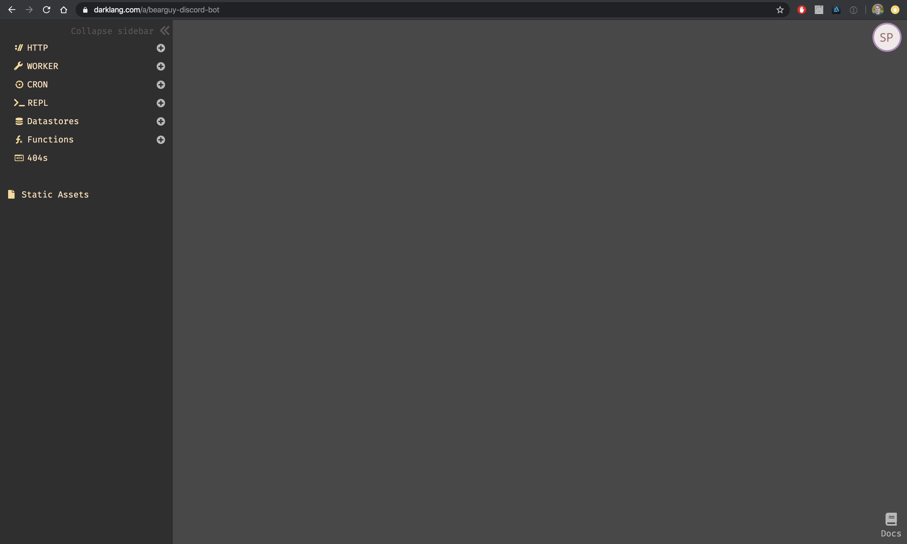
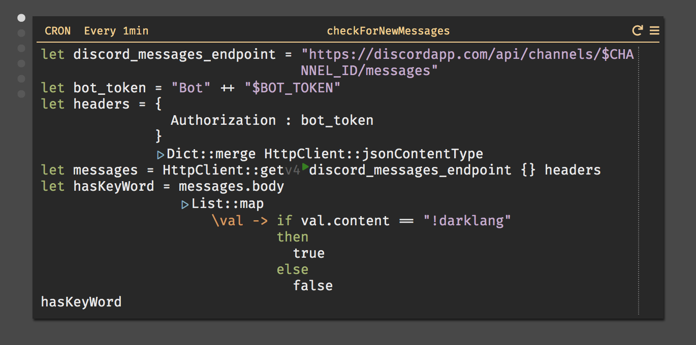
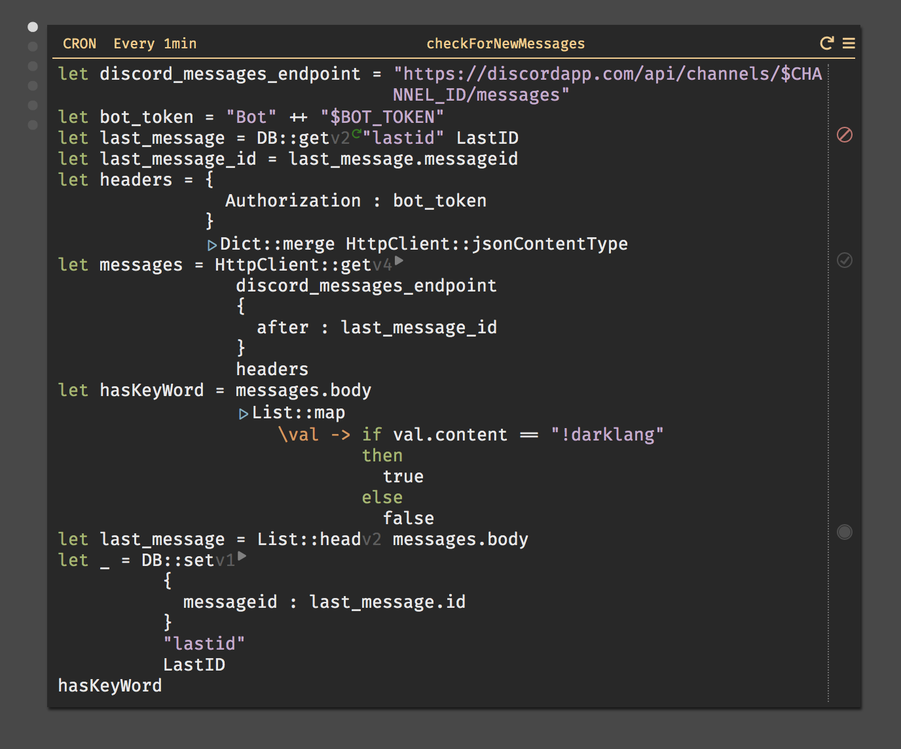
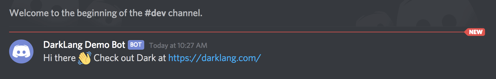
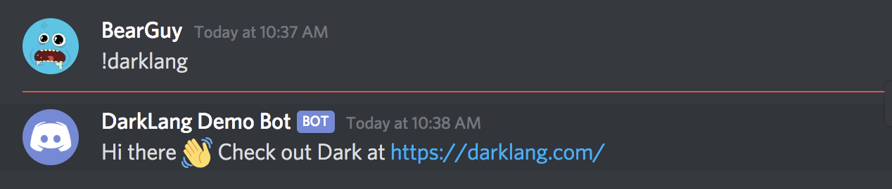

+++
date = 2020-02-14
title = "Let's Make a Discord Bot with Darklang"
description = "The explosion of tooling in programming and development has created a crisis in simply hosting backend applications. Not only do you have to be knowledgable of today's current app frameworks and architecture, you also need sysadmin skills to boot. By necessity developers have needed to learn these skills, and this complexity provides a steep learning curve for new developers."
+++

# What is Darklang?

The explosion of tooling in programming and development has created a crisis in simply hosting backend applications.
Not only do you have to be knowledgable of today's current app frameworks and architecture, you also need sysadmin skills to boot. By necessity developers have needed to learn these skills, and this complexity provides a steep learning curve for new developers. Developers should spend less time fiddling with configuration and more time shipping code.

In comes [Darklang](https://darklang.com). Dark is a new programming language with a holistic take on editing and deploying code. Currently it has a proprietary code editor, which ties very closely to the infrastructure that the code is running on. Pairing editor and infrastructure allows for a new computing paradigm that departs from the incrementalism that has consistently plagued software.

Dark provides essential primitives to write backend applications, which include:
- HTTP Endpoints
- CRON jobs
- Persistent Datastores
- Functions (Workers)
- REPL (for running and testing code)

A combination of these primitives will allow you to build 90% of backend of existing applications. Today, we'll showcase how to build a simple Discord Bot using these Dark tools.

## How Can I Get Started?
Currently the project is in private beta. You can sign up for the beta [here](https://darklang.com/beta), and if you have a specific project in mind that you want to build, you can reach out to Ellen and Paul and ask them to get you in asap.

# Building our First App

### Discord Setup

Assuming you already have a Discord account, we'll head to Discord's Developer Portal and click on the `New Application` button on the top right corner. Let's call the app "DiscordDemo". Click the "Create" button, and we have our app!

We'll want to add a bot to our `DarkDemo` app. We'll click on `Bot` tab on the left handside under `Settings`. We'll be shown the bot page, where we'll click on `Add Bot` to create our bot. We'll get our bot, then give it `Administrator` privleges.

We'll want a test server to try this out. In Discord, we'll create a new server by clicking on `Add Server` button in our server list. Once we have our new server, we'll create a `dev` channel. We'll want to create a webhook so that we can post messages from Dark. We'll click on the `Settings` icon on the `dev` channel list item and get access to `WebHooks`. We'll click the `Create Webhook` button, and give it the name `DarkLang Demo Bot`.

## Writing our Dark Code

Ok, now that we have Discord infrastructure setup we can start to build out our Dark code.

The first thing we want to do is create a new Dark `canvas`. A canvas is our visual environment that we'll be using to create our app. We do this by typing in `https://darklang.com/a/USERNAME-CANVASNAME` and getting our blank canvas! We'll create `https://darklang.com/a/bearguy-discord-bot`.

There's three pieces of information that we'll want to retrieve from Discord. We want our
- Bot Token
- Channel ID
- Webhook URL

First thing we want to do is create our CRON job that will be fetching out our latest messages. It might look something like this:

Unfortunately, Dark does not have support for WebSockets just yet. As much of Discord's Gateway functionality is based around WebSockets, we need to find other ways to get our messages. Currently, we can run a CRON job to fetch new messages every minute. Right now, we're making an api call to `api/channels/$CHANNEL_ID/messages/` to get our messages, using our Bot token as our authorization. We're checking to see if there are any messages that contain the keyword `!darklang`, and returning that boolean value.

We don't want to be checking all of the messages in the channel every call, so we want a way to only check messages past the latest message we've seen. Let's create a datastore for us to track the last message we've received from the API.

We'll integrate this with our existing CRON job like so:

Let's break this down. We're retrieving the latest message saved under the `lastid` key, and passing that as part of our HTTP request with `after`. Following that, we take the head of this new list and update our datastore with our `lastid` key to be the `message.id` of our latest Discord message.

Right now, our program will fail because we won't be retrieving any message ids from our empty `LastID` datastore.
We'll want to manually update the `lastid`. Let's create a REPL to help do this for us. We can run this job manually hitting the `refresh` icon in the top right of our window, and we should see the "Done!"

Ok, now we're getting somewhere! We're now retrieving new messages, and hunting for our keyword `!darklang`. Let's give it some code to execute when it finds our keyword here. We'll create a function called `postToChannel` that will post a message to our channel webhook everytime we find this keyword.

Excellent, now let's hit the `refresh` and try it out. Over in our Discord channel, we'll see:

Cool, now let's bring it all together. We want to be triggering our `postToChannel` function when we detect our keyword in a message. Let's add it to our `checkForNewMessages` CRON job:

Let's type in a `!darkbot` command to the channel and wait for our program to send a message in response. Becuase the limit to CRON job times is 1 minute, you might have to wait a second to see it. But we should be getting something like this:

And there we have it, our Discord bot is operational!

# Conclusion

We've shown just a little bit about what coding in a "deployless" environment looks like, and the many advantages that come with it! This is just the beginning as well, I have confidence that the Dark team will continue to hone the performance and ability of the language as time goes on.

I'm sure many of you want to jump in and try it out yourselves, but like I mentioned earlier Dark is still in a closed beta. You can sign up for the beta [here](https://darklang.com/beta), and if you have a specific project in mind that you want to build, you can reach out to Ellen and Paul and ask them to get you in asap.
