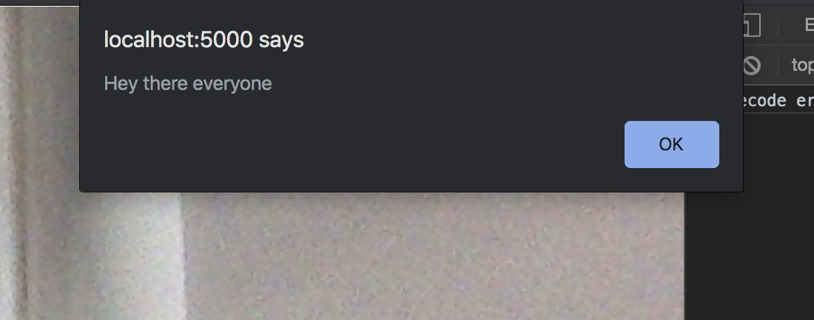
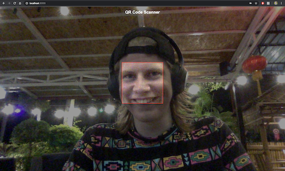
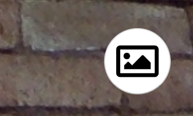

+++
date = 2020-01-26
title = "Building a Web QR Scanner with Snowpack and WebAssembly"
description = "With the capabilities of the modern web, there are a bunch of applications that can be built that were traditionally only possible within native apps. Today, we're going to build a basic QR Scanning app using novel web standards and practices, including ES Modules and WebAssembly."
+++

With the capabilities of the modern web, there are tons of applications that can be built that were traditionally only possible within native apps. Today, we're gonna build a basic QR Scanning app using novel web standards and practices, including ES Modules and WebAssembly.

# Snowpack and App Structure
First thing we'll want to do is create our app directory structure. In order to utilize the fantastic tooling of modern Javascript, we normally have to use a bundler like [Webpack](https://webpack.js.org/) or [Rollup](https://rollupjs.org/) in order to get our CommonJS dependencies to compile on the browser.

However, nowadays there's a new project called [pika.dev](https://pika.dev) that's helping out Javascript developers utilize ES Modules for external dependencies. We're gonna use a program called [Snowpack](https://snowpack.dev) to help us out. Snowpack will help us convert our dependencies in our `node_modules` directory into a `web_modules` directory. These new `web_modules` dependencies can be directly fetched by our browser and run without any bundling required. Super cool.

We'll assume that you have `npm` and `node` installed. If not, I'd recommend downloading the required software for your operating system [here](https://nodejs.org/en/download/). If this is your first time using `npm`, I'd also recommend reading [this article here](https://nodesource.com/blog/an-absolute-beginners-guide-to-using-npm/) about how to use it and what it's good for.

Let's started by installing Snowpack:
```bash
$ npm install --save-dev snowpack
```

Or with yarn:
```bash
$ yarn add --dev snowpack
```

Let's create our project directory. We'll start with:
```bash
$ mkdir wasm-qrscanner
$ cd wasm-qrscanner
$ npm init --yes
```

Next we install our dependencies. We'll be using [Preact](https://preactjs.com) as it's a light and fast React alternative, ideal for small apps that still want to use modern techniques.

```bash
$ npm install --save preact
```
```bash
$ npx snowpack
npx: installed 212 in 56.593s
✔ snowpack installed: preact. [0.22s]
```

We'll want to be using Typescript, so we'll add that as part of our dev dependencies

```bash
$ npm install --save-dev typescript serve concurrently
```

You'll see in our `web_modules` directory we now have `preact.js` file that will be served out to the browser with no additional tooling required. Let's get some basics created to verify this is all working. First, we'll create our HTML index file.

```html
<!-- src/index.html -->

<!DOCTYPE html>
<html lang="en">
  <head>
    <title>WASM QRScanner</title>
    <meta charset="utf-8">
    <meta name="author" content="Stephen Peterkins">
    <meta name="viewport" content="width=device-width,initial-scale=1">
    <meta name="mobile-web-app-capable" content="yes">
    <meta name="apple-mobile-web-app-capable" content="yes">
    <link rel="stylesheet" href="/style.css">
  </head>
  <body>
    <div id="app"></div>
    <script type="module" src="/index.js"></script>
  </body>
</html>
```

Next, we'll create our `src` directory and populate it with `app.js`.
```tsx
// src/index.tsx

import { h, render, FunctionalComponent} from '/web_modules/preact.js'

const App: FunctionalComponent = () => (
  <div>
    <h1>Hello World</h1>
  </div>
);

const appMount = document.querySelector('#app')
if (appMount) render(<App />, appMount)

export default App
```

```json
// package.json

{
  "name": "wasm-qrscanner",
  "version": "1.0.0",
  "description": "",
  "main": "index.js",
  "scripts": {
    "build": "npm run build:ts && npm run build:esm",
    "build:esm": "npx snowpack --dest dist/web_modules --optimize",
    "build:ts": "rm -rf dist && tsc",
    "build:ts:watch": "tsc -w",
    "dev": "npm run build && concurrently 'npm run build:ts:watch' 'serve -s dist'",
    "prestart": "npm run build",
    "start": "serve -s dist"
  },
  "keywords": [],
  "author": "",
  "license": "ISC",
  "snowpack": {
    "webDependencies": [
      "preact"
    ]
  },
  "dependencies": {
    "preact": "^10.2.1"
  },
  "devDependencies": {
    "concurrently": "^5.0.2",
    "serve": "^11.3.0",
    "typescript": "^3.7.5"
  }
}
```

```json
// tsconfig.json

{
  "compilerOptions": {
    "baseUrl": ".",
    "esModuleInterop": true,
    "jsx": "react",
    "jsxFactory": "h",
    "lib": ["dom", "esnext"],
    "module": "esnext",
    "moduleResolution": "node",
    "outDir": "dist",
    "sourceMap": true,
    "strict": true,
    "target": "esnext",
    "paths": {
      "/web_modules/*.js": [
        "node_modules/@types/*",
        "node_modules/*",
        "public/web_modules/*"
      ]
    }
  },
  "exclude": ["node_modules", "web_modules"]
}

```

Run
```bash
$ npm install
$ npm start
```
to take a gander at what it looks like!

That completes our initial project structure setup! Next, we'll want to add the our WebAssembly files to do the heavy lifting of our app.

# Web Assembly and QUIRC files

WebAssembly is a new file format that can run uber performant code in the browser. We'll want to be using `.wasm` files for image recognition and QR decoding process. The first thing we want to do is get our wasm files from a fork of [Daniel Beer's QR decoder library](https://github.com/dlbeer/quirc).

To save some time, we'll be pulling the pre-compiled files from another repo [here](https://github.com/mdchaney/quirc.wasm). If you want to go through the process of compiling them yourself using Emscripten, check out Joshua Koo's repo [here](https://github.com/zz85/quirc.js) (where they did the legwork of getting the library to target WebAssembly), and also check out Emcscripten's documentation to [install and get started using it](https://emscripten.org/docs/getting_started/downloads.html).

The files we're most interested in are these located in the `wasm` directory.
Here are links to download the files we want:
- [quirc.js](https://raw.githubusercontent.com/mdchaney/quirc.wasm/master/wasm/quirc.js)
- [quirc.wasm](https://raw.githubusercontent.com/mdchaney/quirc.wasm/master/wasm/quirc.wasm)

And this is where we'll want to place them in our directory structure:
```
src/lib/quirc/quirc.js
src/lib/quirc/quirc.wasm
```

We'll create a `quirc` directory in a new `lib` directory located in `src`.  It's good practice to separate external libraries and our app logic.

Our `quirc.js` file will be calling our `quirc.wasm` to do most of the heavy lifting of qr decoding. However, we'll ned a way to instantiate and call our `quirc.js` module and have it function with the rest of our existing app logic. The easiest way to achieve this will be running our `quirc` logic as a Javascript Worker.

Let's create a file called `quirc_worker.js` in our `quirc` directory.

```javascript
// src/lib/quirc/quirc_worker.js

var image=null;
var width, height;
var counted;

var Module = {};

// We start by importing our quirc.js script
importScripts('/quirc/quirc.js');


self.onmessage = function(msg) {
  quirc_process_image_data(msg.data);
  postMessage('done');
}

// Our worker recieves raw image data from the decoder,
// then it posts the message back to our listeners.
self.decoded = function(i, version, ecc_level, mask, data_type, payload, payload_len) {
  var payload_string = String.fromCharCode.apply(null,
    new Uint8Array(Module.HEAPU8.buffer, payload, payload_len));
  postMessage({
    i,
    version,
    ecc_level,
    mask,
    data_type,
    payload,
    payload_len,
    payload_string
  });
}

// Receives a simple string with an error
self.decode_error = function(errstr) {
  console.log("decode error: " + errstr);
}

function quirc_process_image_data(img_data) {
  if (!image) {
    width = img_data.width;
    height = img_data.height;
    image = Module._xsetup(width, height);
  }

  var data = img_data.data;

  for (var i=0, j=0; i < data.length; i+=4, j++) {
    // We convert our image data into grayscale here
    // This is to help with edge detection when quirc is attempting pattern recognition
    Module.HEAPU8[image + j] = (data[i] * 66 + data[i + 1] * 129 + data[i + 2] * 25 + 4096) >> 8;
  }

  // Note that "decoded" and/or "decode_error" will be called from within
  var a = Module._xprocess();
}
```

We'll also need to add to our `copy` script in package.json so that we're copying over our `quirc` library when we're building out our `dist` dir.

```json
// package.json

// ...
"scripts": {
  // ...
  "copy": "copyfiles 'src/*.html' 'src/assets/*' 'src/lib/quirc/*.js' ''src/lib/quirc/*.wasm'' 'src/**/*.gif' 'src/*.css' dist -u 1",
  // ...
  }
},

```

Great! We're ready to add our view logic to our QR Scanner. Let's create start to flesh out our app and put our WebAssembly module to good use.

# Preact and WebRTC Video Streams

Let's first start by creating a `components` folder and populating it with the components we'll be using. From the root directory:

```bash
$ cd src
$ mkdir components
$ mkdir components/App
$ touch components/App/index.jsx
$ mkdir components/QRScanner
$ touch components/QRScanner/index.jsx
```

Next, we're gonna want to restructure our entrance into the app to fit our new app architecture. In our `src/index.tsx` file, we'll change it to the following:

```tsx
// src/index.tsx

import { h, render } from '/web_modules/preact.js'
import App from './components/App/index.js'

const appMount = document.querySelector('#app')
if (appMount) render(<App />, appMount)

export default App
```

```tsx
// src/components/App/index.tsx

import { h, FunctionalComponent } from '/web_modules/preact.js'
import QRScanner from '../QRScanner/index.js'

const App: FunctionalComponent = () => (
  <div>
    <QRScanner />
  </div>
)

export default App
```

```tsx
// src/components/QRScanner/index.tsx

import { h, Component } from '/web_modules/preact.js'

type QRScannerProps = {}
type QRScannerState = {
  decoded_string: ''
}

class QRScanner extends Component<QRScannerProps, QRScannerState> {
  render() {
    <div>
      <h1>QRSCanner App</h1>
    </div>
  }
}

export default QRScanner
```

Cool, we have all of the pieces in place. All of our logic will exist in our `QRScanner` component. We'll first add the most important part of a QRSCanner,access to the camera! We want to be retrieving whatever camera accesses our device has, and use it to get image data to our `quirc` module will process and decode.

Modern web standards allow us to do this quite easily with APIs provided by [WebRTC](https://webrtc.org/). We'll start first by adding our HTML `video` element to our QRScanner component.

```tsx
// src/components/QRScanner/index.tsx

import { h, Component } from '/web_modules/preact.js'

type QRScannerProps = {}
type QRScannerState = {
  decoded_string: ''
}

class QRScanner extends Component<QRScannerProps, QRScannerState> {
  render() {
    return (
      <div>
        <div class="video-container">
          <video playsInline autoPlay></video>
        </div>
        <canvas id="qr-canvas"></canvas>
      </div>
    )
  }
}

export default QRScanner
```

We also want to be adding some styling to our `video` element. We'll create a `style.css` file in our root directory and add our styling:

```css
/* src/style.css */
html, body {
  position: relative;
	width: 100%;
	height: 100%;
}

body {
  margin: 0;
	padding: 0;
	box-sizing: border-box;
}

.video-container {
  position: relative;
  top: 0;
  bottom: 0;
  width: 100vw;
  height: 100vh;
  overflow: hidden;
}

.video-container video {
  /* Make video to at least 100% wide and tall */
  min-width: 100%;
  min-height: 100%;

  /* Setting width & height to auto prevents the browser from stretching or squishing the video */
  width: auto;
  height: auto;

  /* Center the video */
  position: absolute;
  top: 50%;
  left: 50%;
  transform: translate(-50%,-50%);
}

#qr-canvas {
  display: none;
}
```

OK, so we have a `video` element which is full screen in our browser. You may have noticed we also have a `canvas` element that's set to be invisible with `display: none`. This `canvas` will be important when we're processing our video stream images.

We won't be able to see any output yet until we enable WebRTC to bind a video stream to our `video` element. Let's do that next.

In `QRScanner.tsx`, we want to initialize WebRTC video when we mount our component.

```tsx
import { h, createRef, Component } from '/web_modules/preact.js'

type QRScannerProps = {}
type QRScannerState = {
  decoded_string: ''
}

class QRScanner extends Component<QRScannerProps, QRScannerState> {

  video = createRef();
  canvas = createRef();

  isStreamInit = false;
  constraints = {
    audio: false,
    video: {
      facingMode: 'environment'
    }
  };

  async componentDidMount() {
    try {
      let stream = await navigator.mediaDevices.getUserMedia(this.constraints);
      this.handleSuccess(stream);
    } catch (err) {
      this.handleError(err);
    }
  }

  handleSuccess(stream: any) {
    this.video.current.srcObject = stream;
    this.isStreamInit = true;
  }

  handleError(error: Error) {
    console.log('navigator.MediaDevices.getUserMedia error: ', error.message, error.name);
  }

  render() {
    return (
      <div>
        <div class="video-container">
          <video playsInline autoPlay ref={this.video}></video>
        </div>
        <canvas id="qr-canvas" ref={this.canvas}></canvas>
      </div>
    )
  }
}

export default QRScanner
```

There's a lot going on here, so let's break it down a bit further.

First, we're creating references for our `video` and `canvas` DOM elements so we can explicitly access these elements in our program.

We're obtaining our video stream by making a request to the browser's `navigator`, which manages permissions surrounding the devices that our app can communicate with. This will trigger a permission request to the user to allow the use of the camera.

If we're given permission, we'll set this video stream provided by the camera to our `video` element. This will then display the stream in our browser window.

Try running it with
```bash
$ npm start
```
and if you've been following along, you should be able to see your beautiful face right there on your screen 😁

Now, it's time for us to add our quirc logic. First, we're gonna want to declare a few more attributes in our `QRScanner` component.

```tsx
  // src/components/QRScanner/index.tsx

  //...

  isStreamInit = false;
  constraints = {
    audio: false,
    video: {
      facingMode: 'environment'
    }
  };

  // quirc wasm
  decoder = new Worker('/lib/quirc/quirc_worker.js');
  last_scanned_raw = new Date().getTime();
  last_scanned_at = new Date().getTime();

  // In milliseconds
  debounce_timeout = 750;
```

Next, we'll be using this attributes in our `componentDidMount` function to kickoff the decoder logic using our `Worker`.

```typescript
async componentDidMount() {
  this.decoder.onmessage = (msg) => { this.onDecoderMessage(msg) };

  try {
    let stream = await navigator.mediaDevices.getUserMedia(this.constraints);
    this.handleSuccess(stream);
  } catch (err) {
    this.handleError(err);
  }

  setTimeout(() => { this.attemptQRDecode() }, this.debounce_timeout);
}
```

Let's break down what we're doing here. First, we're getting our `canvas_context`, which will help us get a "snapshot" of our video stream that will be fed into the `quirc` module to start the process of scanning for QR codes.

We're overriding our `decoder` Worker's `onmessage` function to a function called `onDecoderMessage`. `onDecoderMessage` will accept a decoded message passed from the `quirc` module.

We'll also be delaying initializing the scanning function `attemptQRDecode`. This function is pretty self explanatory, we'll be attempting to decode a snapshot of our video stream to detect if there's any QR codes in frame. If there is, it will attempt to successfully decode it and pass the decoded message to our `onDecoderMessage` function.

Let's create both our `attemptQRDecode` and `onDecoderMessage` functions next.

```tsx
// src/components/QRScanner/index.tsx

// ...

attemptQRDecode() {
  if (this.isStreamInit)  {
    try {
      let canvas_context = this.canvas.current.getContext("2d");
      this.canvas.current.width = this.video.current.videoWidth;
      this.canvas.current.height = this.video.current.videoHeight;
      canvas_context.drawImage(this.video.current, 0, 0, this.canvas.current.width, this.canvas.current.height);

      var imgData = canvas_context.getImageData(0, 0, this.canvas.current.width, this.canvas.current.height);

      if (imgData.data) {
        this.decoder.postMessage(imgData);
      }
    } catch (err) {
      if (err.name == 'NS_ERROR_NOT_AVAILABLE') setTimeout(() => { this.attemptQRDecode() }, 0);
        console.log("Error");
        console.log(err);
    }
  }
}
```

In `attemptQRDecode`, we're getting the frame data of the video stream and converting it into an image using our `canvas_context` attribute. Once we have this image saved in our `imgData` variable, we fire it off to our  Worker's `decoder` function to start the processing.

If the decoder is able to detect and decode a QR code successfully, it will run the `onmessage` function that we've set to run our `onDecoderMessage`. Let's create that logic right now.

```tsx
// src/components/QRScanner/index.tsx

// ...

onDecoderMessage(msg: any) {
  if (msg.data != 'done') {

    const qrid = msg.data['payload_string'];
    const right_now = Date.now();

    if (qrid != this.last_scanned_raw || this.last_scanned_at < right_now - this.debounce_timeout) {
      this.last_scanned_raw = qrid;
      this.last_scanned_at = right_now;

      alert(qrid);
    } else if (qrid == this.last_scanned_raw) {
      this.last_scanned_at = right_now;
    }
  }
  setTimeout(() => { this.attemptQRDecode() }, 0);
}
```

In our function, we want to receive our `payload_string` from the `msg`, as this is our decoded message. We also cache the last successful scan data in `last_scanned_raw` so that the user doesn't get spammed over and over with the their decoded information. We also manually check that we're passed our set `debounce_timeout`. Once these factors have been cleared, we'll show the `qrid` with the built in `alert` function to display the information in the browser.

Let's run our code with `npm start` once again to test it out. For testing purposes, I'd recommend using this [online QR code generator](https://the-qrcode-generator.com) to create a QR code on your phone. Running the app, you'll see yourself on your screen using your camera. Pointing our phone screens (with our newly generated QR code on it) at our laptop screens will allow our program to decode it.



Success! We officially have a working QR Code Scanner! 🎉🎊 Give yourself a pat on the back for making it this far.

While we have a working prototype, it's still lacking a lot of the style that makes it "feel" like it's really scanning anything. For first time users, they wouldn't know what the app is supposed to do. Let's add some visual styling to make it clear what our app means to accomplish.

# QR Scanner Styling

Most QR scanners are going to put a dark filter over the screen except for a square in the middle. This is the target that the user is supposed to line up the QR code with. This sort of styling has a purpose, it's there to provide intuitive knowledge of how to use the scanner for first time users.

We'll want to edit our QRScanner component's `render` function to add the necessary elements:

```tsx
// src/components/QRScanner.index.tsx

// ...

render() {
  return (
    <div>
      <div id="qr-hud">
        <div class="opaque-black" id="qr-hud-header">
          <h2>QR Code Scanner</h2>
        </div>
        <div id="qr-hud-body">
          <div class="opaque-black" id="qr-hud-top"></div>
          <div id="qr-hud-mid">
            <div class="opaque-black"></div>
            <div id="qr-hud-target"></div>
            <div class="opaque-black"></div>
          </div>
          <div class="opaque-black" id="qr-hud-bot"></div>
        </div>
      </div>
      <div class="video-container">
        <video playsInline autoPlay ref={this.video}></video>
      </div>
      <canvas id="qr-canvas" ref={this.canvas}></canvas>
    </div>
  )
}
```

Now that we have our elements in place, we'll add append our new styling here:

```css
.opaque-black {
  background: rgb(0,0,0,0.4);
}

#qr-hud {
  position: absolute;
  z-index: 100;
  width: 100vw;
  height: 100vh;
  display: grid;
  grid-template-rows: 4em auto;
}

#qr-hud-header {
  color: white;
  padding: 0 1em;
  display: grid;
  align-items: center;
}

#qr-hud-header h2 {
  text-align: center;
  font-family: arial;
}

#qr-hud-body {
  display: grid;
  grid-template-rows: 2fr auto 3fr;
}

#qr-hud-mid {
  display: grid;
  grid-template-columns: 1fr auto 1fr;
}

.qr-hud-mid-opacity {
  opacity: 0.4;
  background: black;
}

#qr-hud-target {
  width: 18em;
  height: 18em;
  border: 2px solid red;
  background-color: transparent;
}
```

Let's take a quick preview to see how this looks.



Not too shabby (and I'm not just talking about myself here). We have the basics of a QR Code Scanner, however you might have noticed how awkward it is attempting to scan QR Codes on your desktop machine (on mobile it's a more fluid experience).

As I've noted previously, all we're doing is passing a "snapshot" image to our decoder to retrieve the information. We should also be able to pass just regular QR code images for our `quirc` module to decode. Let's implement this as our final feature.

# Decode QR Code from Image

_* Disclaimer: I have yet to get this to successfully work. If you know what I'm doing wrong here, I would love to receive feedback from you *_

First thing we'll want to add is a button to trigger our image selection. Let's add a button on the bottom right-hand side of the screen and add some javascript events to it.

```tsx
// src/components/QRScanner/index.tsx

// ...

class QRScanner extends Component<QRScannerProps, QRScannerState> {
  video = createRef();
  canvas = createRef();

  // we'll select this during the `onClick` event of our button element
  file_input = createRef();

  // ...

  render() {
    return (
      <div>
        <div id="qr-hud">
          <div class="opaque-black" id="qr-hud-header">
            <h2>QR Code Scanner</h2>
          </div>
          <div id="qr-hud-body">
            <div class="opaque-black" id="qr-hud-top"></div>
            <div id="qr-hud-mid">
              <div class="opaque-black"></div>
              <div id="qr-hud-target"></div>
              <div class="opaque-black"></div>
            </div>
            <div class="opaque-black" id="qr-hud-bot"></div>
          </div>
        </div>
        <div class="video-container">
          <video playsInline autoPlay ref={this.video}></video>
        </div>
        <canvas id="qr-canvas" ref={this.canvas}></canvas>

        {/* We'll be appending this to our screeen */}

        <input id="file-input" type="file" ref={this.file_input}/>
        <button id="qr-scanner-button" class="create-button">
          </i>
        </button>

      </div>
    )
  }
}
```

We can download the `image-regular.svg` from [FontAwesome's website](https://fontawesome.com/icons/image?style=regular).

And now, let's style our new elements:

```css
/* src/style.css */

/* ... */

#file-input {
  display: none;
}

#qr-scanner-button {
  position: absolute;
  bottom: 1em;
  right: 1em;
  z-index: 1000;
  width: 3em;
  height: 3em;
  padding: 0.5em;
  background: white;
}
```

A quick preview should show our button on the right hand corner here:



Now we need to add some events to our new button. We'll want a function to be bound to the `onClick` attribute of our `button`.

```typescript
// src/components/QRScanner/index.tsx

// ...

decodeFromFile(f: File) {
  var reader = new FileReader();
  const URL = window.URL || window.webkitURL;
  reader.onload = (file => {
    return (e: any) => {
      var img = new Image();
      img.onload = () => {
        let canvas_ctx = this.canvas.current.getContext("2d");
        canvas_ctx.drawImage(img, 0, 0);
        let imgData = canvas_ctx.getImageData(0, 0, img.width, img.height);
        if (imgData.data) {
          this.decoder.postMessage(imgData);
        }
      }
      let urlData: string = reader.result as string;
      img.src = urlData;
    };
  })(f);
  reader.readAsDataURL(f);
}

onButtonClick() {
  let inputFile  = this.file_input.current;
  inputFile.onchange = (e: any) => {
    let file = e.target.files[0];

    // Check we give a file
    if (!file) return;

    // Check that the file is an image
    if(file.type !== '' && !file.type.match('image.*')) return;
    this.decodeFromFile(file);
  };
  inputFile.click();
}

// ...
```

Our QR code scanner should now be able to decode the QR from our file. Neat!

# Conclusion

In this tutorial, we have create a QR Code scanner with WebAssembly and the latest in modern web technology. As a component, you'll easily be able to export this functionality to any app you'll be creating in the future.

We've showcased how to one can use WebAssembly for the most performance critical portions of our application, and how bundlers are not a requirement for modern web development.


GitHub repo of the tutorial: [https://github.com/BearGuy/wasm-qrscanner](https://github.com/BearGuy/wasm-qrscanner)

Demo: [https://gifted-bhaskara-a52e4f.netlify.com](https://gifted-bhaskara-a52e4f.netlify.com)
